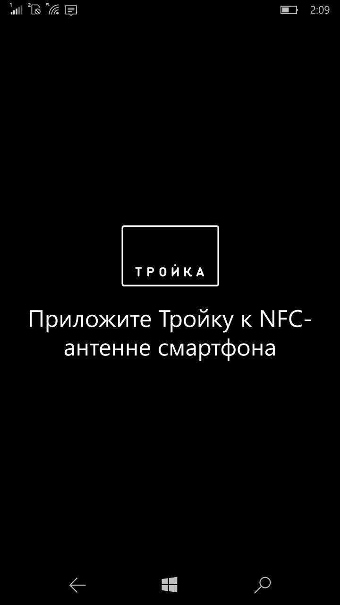
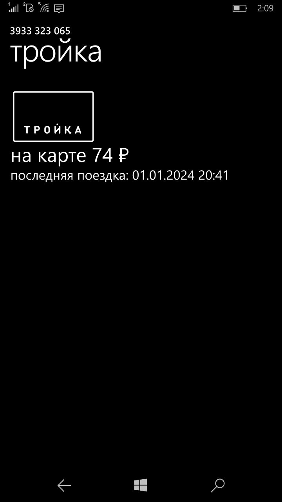

# Тройка для Windows Phone

Читалка карт Тройка для устройств на Windows Phone 8.1 и Windows 10 Mobile. Поддерживается с WP8.1 и выше.

Перед установкой на смарт убедитесь, что в вашем виндофоне есть NFC и поддержка Mifare Classic. Если NFC будет отсутствовать, то приложение банально не запустится.

## Скриншоты

## Хочу это забилдить

Убедитесь, что у вас

- Есть компьютер на Windows 10 и выше (8.1 не вариант, так как там для деплоя нужна лицензия разработчика, которую уже невозможно получить)
- Установлен Visual Studio 2015 Community Edition (скачать можно [тут](https://archive.org/details/vs2015.3.com_enu_202102&e=124743917) например)
- Играет в наушниках THRILL PILL (необязательный шаг)
